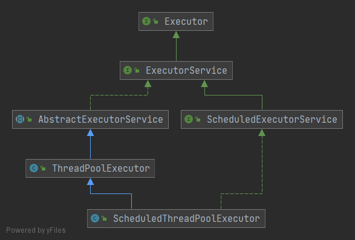
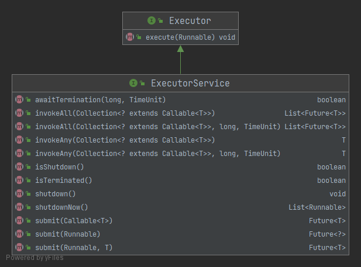
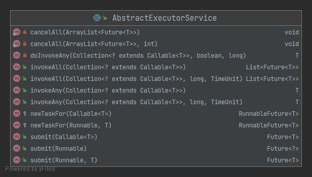
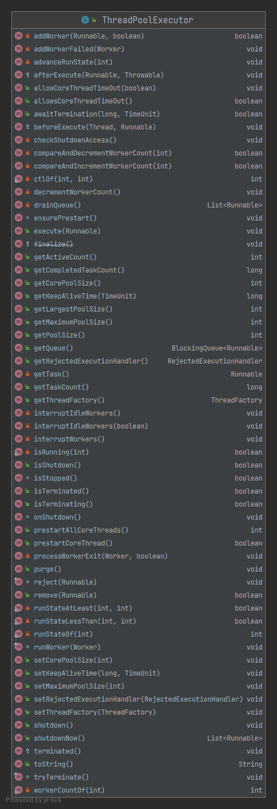
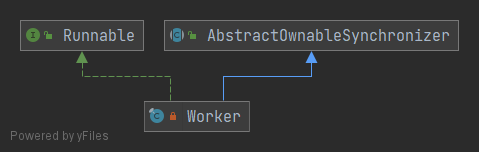
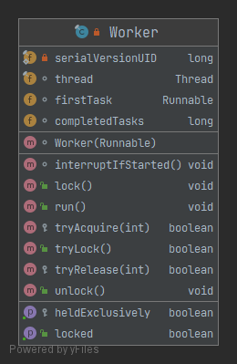

## 1 Executor 框架

Executor 框架的依赖关系图：



### 1.1 Executor 接口

`Executor` 接口仅包含一个 `void execute(Runnable command);` 方法。

顶层接口 Executor 提供了一种思想：将任务提交和任务执行进行解耦。用户无需关注如何创建线程，如何调度线程来执行任务，用户只需提供 Runnable 对象，将任务的运行逻辑提交到执行器(Executor)中，由 Executor 框架完成线程的调配和任务的执行部分。

### 1.2 ExecutorService 接口

`ExecutorService` 接口对 `Executor` 接口进行了如下扩展，增加了一些能力：（1）扩充执行任务的能力，补充可以为一个或一批异步任务生成 Future 的方法；（2）提供了管控线程池的方法，比如停止线程池的运行。



- `awaitTermination` 阻塞方法，等待线程池退出后才会结束自身。
- `invokeAll` 进行批量提交
- `isShutdown` 判断是否 shutdown
- `isTerminated` 如果所有任务在关闭后都已完成，则返回 true。除非首先调用了 shutdown 或 shutdownNow，否则 isTerminated 永远不会为真。
- `shutdown` 将线程池的状态设置为 SHUTWDOWN 状态，正在执行的任务会继续执行下去，没有被执行的则中断。此时，不能添加新任务，否则抛出 RejectedExecutionException 异常。
- `shutdownNow` 则是将线程池的状态设置为 STOP，正在执行的任务则被停止，没被执行任务的则返回。它试图终止线程的方法是通过调用 `Thread.interrupt()` 方法来实现的，但是这种方法的作用有限，如果线程中没有 sleep 、wait、Condition、定时锁等应用, interrupt() 方法是无法中断当前的线程的。所以，ShutdownNow() 并不代表线程池就一定立即就能退出，它可能必须要等待所有正在执行的任务都执行完成了才能退出。
- `submit` 提交不同类型的任务

### 1.3 AbstractExecutorService 抽象类

实现了 `ExecutorService` 接口，实现了 `invokeAll` 、 `invokeAny` 、 `submit` 方法。`ThreadPoolExecutor` 类直接继承了这些方法，没有重写方法。(后续再了解任务的执行过程的时候，直接看这里的源码)



### 1.4 ThreadPoolExecutor 类

继承了 `AbstractExecutorService` 抽象类，线程池的主要实现类。



### 1.5 ScheduledExecutorService 接口

周期性执行或延迟执行，后续再学习。

### 1.6 ScheduledThreadPoolExecutor 类

周期性执行或延迟执行，后续再学习。

## 2 ThreadPoolExecutor 类分析

### 2.1 构造函数

```java
public ThreadPoolExecutor(int corePoolSize,
						  int maximumPoolSize,
						  long keepAliveTime,
						  TimeUnit unit,
						  BlockingQueue<Runnable> workQueue,
						  ThreadFactory threadFactory,
						  RejectedExecutionHandler handler) {
	if (corePoolSize < 0 ||
		maximumPoolSize <= 0 ||
		maximumPoolSize < corePoolSize ||
		keepAliveTime < 0)
		throw new IllegalArgumentException();
	if (workQueue == null || threadFactory == null || handler == null)
		throw new NullPointerException();
	this.corePoolSize = corePoolSize;
	this.maximumPoolSize = maximumPoolSize;
	this.workQueue = workQueue;
	this.keepAliveTime = unit.toNanos(keepAliveTime);
	this.threadFactory = threadFactory;
	this.handler = handler;
}
```

- `corePoolSize` 线程池的核心线程数量，定义了最小可以同时运行的线程数量。
- `maximumPoolSize` 线程池的最大线程数，当队列中存放的任务达到队列容量时，当前可以同时运行的线程数量变为最大线程数。
- `keepAliveTime` 当线程数大于 corePoolSize 时，空闲的线程能存活的时间，超过就销毁线程。
- `unit` 时间单位。
- `workQueue` 任务队列，用来储存等待执行任务的队列。
- `threadFactory` 线程工厂，用来创建线程，一般默认即可。
- `handler` 拒绝策略，当任务过多时，该如何处理新任务。

### 2.2 ThreadPoolExecutor 运行机制

线程池在内部实际上构建了一个生产者消费者模型，将线程和任务两者解耦，并不直接关联，从而良好的缓冲任务，复用线程。线程池的运行主要分成两部分：任务管理、线程管理。

任务管理部分充当生产者的角色，当任务提交后，线程池会判断该任务后续的流转：（1）直接申请线程执行该任务；（2）缓冲到队列中等待线程执行；（3）拒绝该任务。

线程管理部分是消费者，它们被统一维护在线程池内，根据任务请求进行线程的分配，当线程执行完任务后则会继续获取新的任务去执行，最终当线程获取不到任务的时候，线程就会被回收。


### 2.3 线程池的状态/生命周期

ThreadPoolExecutor 类包含多个成员变量与相关函数，如下所示。

```java
private final AtomicInteger ctl = new AtomicInteger(ctlOf(RUNNING, 0));  
private static final int COUNT_BITS = Integer.SIZE - 3;  
private static final int COUNT_MASK = (1 << COUNT_BITS) - 1;  
  
// runState is stored in the high-order bits  
private static final int RUNNING = -1 << COUNT_BITS;  
private static final int SHUTDOWN =  0 << COUNT_BITS;  
private static final int STOP =  1 << COUNT_BITS;  
private static final int TIDYING =  2 << COUNT_BITS;  
private static final int TERMINATED =  3 << COUNT_BITS;  
  
// Packing and unpacking ctl  
private static int runStateOf(int c)     { return c & ~COUNT_MASK; }  
private static int workerCountOf(int c)  { return c & COUNT_MASK; }  
private static int ctlOf(int rs, int wc) { return rs | wc; }

private static boolean runStateLessThan(int c, int s) { return c < s;}
private static boolean runStateAtLeast(int c, int s) { return c >= s;}
private static boolean isRunning(int c) { return c < SHUTDOWN;}
```

`ctl` 用来存储**运行状态**(runState)和**线程数量** (workerCount)。其中，低 29 位用于存储线程数量，高 3 位用来存储运行状态。官方注释表示，若线程数目称为问题，则可以将 AtomicInteger 更改为 AtomicLong，并且调整后面的移位/掩码就可以。

对于 `ctl` 变量，有三个相对应的方法。`runStateOf` 计算当前运行状态，`workerCountOf` 计算当前线程数量，`ctlOf` 根据状态和线程数生成 ctl。

ThreadPoolExecutor 有 5 种运行状态：
- `RUNNING` 能接受提交的任务，并且能够处理阻塞队列的任务。
- `SHUTDOWN` 关闭状态，不再接受新提交的任务，但可以继续处理阻塞队列中已保存的任务。
- `STOP` 不能接受新任务，也不处理队列中的任务，会中断正在处理任务的线程。
- `TIDYING` 所有任务都已终止，workerCount 有效线程数为 0.
- `TERMINATED` 在 terminated 方法执行完后进入该状态。

这 5 种运行状态从上到下依次递增，叠加线程数量后，可以通过比较运算来判断处于的运行状态。

运行状态转换/生命周期如下：


### 2.4 任务执行机制
#### 2.4.1 任务分配

`Runnable` 或 `Callable` 对象通过 `submit` 方法传入时，会由 `AbstractExecutorService` 抽象类将输入转换为 `RunnableFuture<?>` 对象，然后调用 `ThreadPoolExecutor` 的 `execute(Runnable)` 方法执行。`Runnable` 对象也可以通过 `execute` 方法传入，则直接调用 `ThreadPoolExecutor` 的 `execute(Runnable)` 方法执行。

`AbstractExecutorService` 抽象类对于 `submit` 方法的实现。
```java
public Future<?> submit(Runnable task) {  
    if (task == null) throw new NullPointerException();  
	 RunnableFuture<Void> ftask = newTaskFor(task, null);  
	 execute(ftask);  
	 return ftask;  
}  
  
 public <T> Future<T> submit(Runnable task, T result) {  
    if (task == null) throw new NullPointerException();  
	 RunnableFuture<T> ftask = newTaskFor(task, result);  
	 execute(ftask);  
	 return ftask;  
}  
  
 public <T> Future<T> submit(Callable<T> task) {  
	 if (task == null) throw new NullPointerException();  
	 RunnableFuture<T> ftask = newTaskFor(task);  
	 execute(ftask);  
	 return ftask;  
}
```

`ThreadPoolExecutor` 类对 `execute` 方法的实现。
```java
    public void execute(Runnable command) {
        if (command == null)
            throw new NullPointerException();
        int c = ctl.get();
        if (workerCountOf(c) < corePoolSize) {
            if (addWorker(command, true))
                return;
            c = ctl.get();
        }
        if (isRunning(c) && workQueue.offer(command)) {
            int recheck = ctl.get();
            if (! isRunning(recheck) && remove(command))
                reject(command);
            else if (workerCountOf(recheck) == 0)
                addWorker(null, false);
        }
        else if (!addWorker(command, false))
            reject(command);
    }
```

如果一个任务可以成功入队，那么仍然需要仔细检查是否应该添加一个线程（因为可能现有的线程自上次检查后就死了）或者任务在进入此方法后线程池关闭。因此，重新检查状态，如果有必要，如果停止排队，则回滚，或者如果没有，则启动一个新线程。

大致执行流程如下：


#### 2.4.2 任务缓冲

`ThreadPoolExecutor` 使用阻塞队列来缓冲需要执行的任务，对应成员变量如下：
`private final BlockingQueue<Runnable> workQueue;`

在 `execute` 方法中，将 `Runnable` 对象添加进阻塞队列中，是唯一入口；在 `getTask` 方法中，从阻塞队列中取出一个 `Runnable` 对象，是唯一出口。

补充一个阻塞队列的各种实现类。


#### 2.4.3 任务获取

```java
private Runnable getTask() {
		// BlockingQueue的poll方法是否已经超时
        boolean timedOut = false; 
        for (;;) {
            int c = ctl.get();
			// 如果线程池状态>=SHUTDOWN,并且BlockingQueue为null;
	        // 或者线程池状态>=STOP
	        // 以上两种情况都减少工作线程的数量, 返回的task为null
            if (runStateAtLeast(c, SHUTDOWN)
                && (runStateAtLeast(c, STOP) || workQueue.isEmpty())) {
                decrementWorkerCount();
                return null;
            }
            // 获得当前工作线程个数
            int wc = workerCountOf(c);  
            // 当前线程是否需要被淘汰
            boolean timed = allowCoreThreadTimeOut || wc > corePoolSize; 
            if ((wc > maximumPoolSize || (timed && timedOut))
                && (wc > 1 || workQueue.isEmpty())) {
                if (compareAndDecrementWorkerCount(c))
                    return null;
                continue;
            }
            try {
	            // BlockingQueue的poll方法超时会直接返回null
	            // BlockingQueue的take方法, 如果队列中没有元素, 当前线程会wait, 直到其他线程提交任务入队唤醒当前线程.
                Runnable r = timed ?
                    workQueue.poll(keepAliveTime, TimeUnit.NANOSECONDS) :
                    workQueue.take();
                if (r != null)
                    return r;
                timedOut = true;
            } catch (InterruptedException retry) {
                timedOut = false;
            }
        }
    }
```

#### 2.4.4 任务拒绝

任务拒绝模块是线程池的保护部分，线程池有一个最大的容量，当线程池的任务缓存队列已满，并且线程池中的线程数目达到 maximumPoolSize 时，就需要拒绝掉该任务，采取任务拒绝策略，保护线程池。

拒绝策略是一个接口，其设计如下：

```Java
public interface RejectedExecutionHandler {
    void rejectedExecution(Runnable r, ThreadPoolExecutor executor);
}
```

用户可以通过实现这个接口去定制拒绝策略，也可以选择 JDK 提供的四种已有拒绝策略，其特点如下：


```java
public static class CallerRunsPolicy implements RejectedExecutionHandler {
	public CallerRunsPolicy() { }
	public void rejectedExecution(Runnable r, ThreadPoolExecutor e) {
		if (!e.isShutdown()) { r.run(); }
	}
}
public static class AbortPolicy implements RejectedExecutionHandler {
	public AbortPolicy() { }
	public void rejectedExecution(Runnable r, ThreadPoolExecutor e) {
		throw new RejectedExecutionException("Task " + r.toString() + " rejected from " + e.toString());
	}
}
public static class DiscardPolicy implements RejectedExecutionHandler {
	public DiscardPolicy() { }
	public void rejectedExecution(Runnable r, ThreadPoolExecutor e) { }
}

public static class DiscardOldestPolicy implements RejectedExecutionHandler {
	public DiscardOldestPolicy() { }
	public void rejectedExecution(Runnable r, ThreadPoolExecutor e) {
		if (!e.isShutdown()) {
			e.getQueue().poll();
			e.execute(r);
		}
	}
}
```

### 2.5 线程执行机制
#### 2.5.1 工作线程的基本信息
线程池为了更好的掌握线程的状态并维护线程的生命周期，设计了 `Worker` 类作为工作线程对象。并使用 `private final HashSet<Worker> workers` 来管理工作线程的生命周期。当创建新工作线程时，将新 `Worker` 添加到 `workers` 中；当需要销毁工作线程时，从 `workers` 中将对应 `Worker` 删除掉。期间会有很多设计到线程池状态的判断。

> (AQS 还不会，这部分稍后再看)
> Worker 是通过继承 AQS，使用 AQS 来实现独占锁这个功能。没有使用可重入锁 ReentrantLock，而是使用 AQS，为的就是实现不可重入的特性去反应线程现在的执行状态。
> 
> 1. lock 方法一旦获取了独占锁，表示当前线程正在执行任务中。 
> 2. 如果正在执行任务，则不应该中断线程。 
> 3. 如果该线程现在不是独占锁的状态，也就是空闲的状态，说明它没有在处理任务，这时可以对该线程进行中断。 
> 4. 线程池在执行 shutdown 方法或 tryTerminate 方法时会调用 interruptIdleWorkers 方法来中断空闲的线程，interruptIdleWorkers 方法会使用 tryLock 方法来判断线程池中的线程是否是空闲状态；如果线程是空闲状态则可以安全回收。

Worker 类的依赖关系与类信息等如下：





工作线程执行任务的整个过程:


#### 2.5.2 工作线程的属性与构造函数

```java
private final class Worker extends AbstractQueuedSynchronizer implements Runnable {
	final Thread thread;
	Runnable firstTask;
	volatile long completedTasks;
	Worker(Runnable firstTask) {
		setState(-1); // inhibit interrupts until  // runWorker 调用AQS的方法，还不了解
		this.firstTask = firstTask;
		this.thread = getThreadFactory().newThread(this);
	}
}
```

- `final Thread thread` Worker 持有的线程，在创建 Worker 时通过 `ThreadFactory` 线程工厂来创建线程。
- `Runnable firstTask` 初始化的任务，可以为 null。
- `volatile long completedTasks` 每个线程完成的任务数。

#### 2.5.3 工作线程申请

申请工作线程是通过 `addWorker` 方法来执行的。`firstTask` 参数表示指定新增线程要执行的第一个任务，参数可以为空，为空直接返回 `false`。`core` 参数，`true` 时判断当前活动线程数是否小于 `corePoolSize`，`false` 时判断是否小于 `maximumPoolSize`。

```java
private boolean addWorker(Runnable firstTask, boolean core) {
	// 申请添加工作线程
	retry:
	for (int c = ctl.get();;) {
		// 当线程运行状态大于等于SHUTDOWN，提交的firstTask为空，阻塞队列为空
		// 则无法创建新线程，返回false
		if (runStateAtLeast(c, SHUTDOWN)
			&& (runStateAtLeast(c, STOP)
				|| firstTask != null
				|| workQueue.isEmpty()))
			return false;

		for (;;) {
			// 当前的工作线程数目不小于corePoolSize或maximumPoolSize规定的数目
			// 则无法创建新线程，返回false
			if (workerCountOf(c)
				>= ((core ? corePoolSize : maximumPoolSize) & COUNT_MASK))
				return false;
			// CAS 机制尝试增加一个工作线程，成功则终止循环
			if (compareAndIncrementWorkerCount(c))
				break retry;
			// CAS 失败了，说明ctl被更新，重新获取ctl值
			c = ctl.get(); 
			// 如果运行状态至少为SHUTDOWN，那么重新进行retry判断状态以及后续执行
			if (runStateAtLeast(c, SHUTDOWN))
				continue retry;
			// 运行状态仍然是RUNNING状态，重试内部循环，判断能否添加新工作线程
		}
	}
	
	// 申请添加新工作线程成功
	// 两个状态，一个是工作线程添加成功状态workerAdded
	// 一个是工作线程启动工作状态workerStarted
	boolean workerStarted = false;
	boolean workerAdded = false;
	Worker w = null;
	try {
		w = new Worker(firstTask); // 创建工作线程
		final Thread t = w.thread;
		if (t != null) {
			final ReentrantLock mainLock = this.mainLock;
			mainLock.lock(); // 加锁
			try {
				// Recheck while holding lock.
				// Back out on ThreadFactory failure or if
				// shut down before lock acquired.
				int c = ctl.get(); // 加锁后，重新获得状态
				// 如果是RUNNING状态, 或者是SHUTDOWN状态并且传入的task为null
				// 则执行workQueue中的task
				if (isRunning(c) ||
					(runStateLessThan(c, STOP) && firstTask == null)) {
					// 线程已经被启动, 抛出IllegalThreadStateException
					if (t.getState() != Thread.State.NEW)
						throw new IllegalThreadStateException();
					// 将worker对象添加到HashSet，并更新workerAdded状态
					workers.add(w);
					workerAdded = true;
					// 线程池中曾经达到的最大线程数
					int s = workers.size();
					if (s > largestPoolSize)
						largestPoolSize = s;
				}
			} finally {
				mainLock.unlock(); // 释放锁
			}
			// 如果worker被添加成功, 启动线程, 执行对应的task，并更新workerStarted状态
			if (workerAdded) {
				t.start();
				workerStarted = true;
			}
		}
	} finally {
		// 如果线程启动失败, 执行addWorkerFailed方法
		if (! workerStarted)
			addWorkerFailed(w);
	}
	return workerStarted;
}
```

#### 2.5.4 工作线程回收
线程池中线程的销毁依赖 JVM 自动的回收，线程池做的工作是根据当前线程池的状态维护一定数量的线程引用，防止这部分线程被 JVM 回收，当线程池决定哪些线程需要回收时，只需要将其引用消除即可。Worker 被创建出来后，就会不断地进行轮询，然后获取任务去执行，核心线程可以无限等待获取任务，非核心线程要限时获取任务。当 Worker 无法获取到任务，也就是获取的任务为空时，循环会结束，Worker 会主动消除自身在线程池内的引用。如下述代码所示。

```java
// runWorker 方法
try {
  while (task != null || (task = getTask()) != null) {
    //执行任务
  }
} finally {
  processWorkerExit(w, completedAbruptly);//获取不到任务时，主动回收自己
}
```

线程回收的工作是在 processWorkerExit 方法完成的。


事实上，在这个方法中，将线程引用移出线程池就已经结束了线程销毁的部分。但由于引起线程销毁的可能性有很多，线程池还要判断是什么引发了这次销毁，是否要改变线程池的现阶段状态，是否要根据新状态，重新分配线程。

```java
    private void processWorkerExit(Worker w, boolean completedAbruptly) {
        if (completedAbruptly) // If abrupt, then workerCount wasn't adjusted
            decrementWorkerCount();

        final ReentrantLock mainLock = this.mainLock;
        mainLock.lock();
        try {
            completedTaskCount += w.completedTasks;
            workers.remove(w);
        } finally {
            mainLock.unlock();
        }

        tryTerminate();

        int c = ctl.get();
        if (runStateLessThan(c, STOP)) {
            if (!completedAbruptly) {
                int min = allowCoreThreadTimeOut ? 0 : corePoolSize;
                if (min == 0 && ! workQueue.isEmpty())
                    min = 1;
                if (workerCountOf(c) >= min)
                    return; // replacement not needed
            }
            addWorker(null, false);
        }
    }
```

#### 2.5.5 工作线程执行任务

```java
    final void runWorker(Worker w) {
        Thread wt = Thread.currentThread();
        Runnable task = w.firstTask;
        w.firstTask = null;
        w.unlock(); // allow interrupts
        boolean completedAbruptly = true;
        try {
	        // 当传入的task不为null, 或者task为null但是从BlockingQueue中获取的task不为null
            while (task != null || (task = getTask()) != null) {
                w.lock();  // 执行任务之前先获取锁
                // 线程池状态如果为STOP, 或者当前线程是被中断并且线程池是STOP状态, 
                // 或者当前线程不是被中断; 
                // 则调用interrupt方法中断当前线程
                if ((runStateAtLeast(ctl.get(), STOP) ||
                     (Thread.interrupted() &&
                      runStateAtLeast(ctl.get(), STOP))) &&
                    !wt.isInterrupted())
                    wt.interrupt();
                try {
	                // beforeExecute hook方法
                    beforeExecute(wt, task);
                    try {
	                    // 真正执行提交的task的run方法
                        task.run();
                        // afterExecute hook方法
                        afterExecute(task, null);
                    } catch (Throwable ex) {
                        afterExecute(task, ex);
                        throw ex;
                    }
                } finally {
	                // task赋值为null, 下次从BlockingQueue中获取task
                    task = null;
                    w.completedTasks++;
                    w.unlock();
                }
            }
            completedAbruptly = false;
        } finally {
            processWorkerExit(w, completedAbruptly);
        }
    }
```


## 3 Executors 工厂

### 3.1 常见的线程池
《阿里巴巴 Java 开发手册》指出，不能使用 Executors 工厂内置的创建线程池方法，要自行根据情况使用 ThreadPoolExecutor 的构造函数创建。(平时小 demo 问题不大)

#### 3.1.1 FixedThreadPool
`corePoolSize = maximumPoolSize`, `keepAliveTime = 0`, 使用无界队列 `LinkedBlockingQueue`。

```java
public static ExecutorService newFixedThreadPool(int nThreads) {
	return new ThreadPoolExecutor(nThreads, nThreads, 0L, TimeUnit.MILLISECONDS,
								  new LinkedBlockingQueue<Runnable>());
}
public static ExecutorService newFixedThreadPool(int nThreads, ThreadFactory threadFactory) {
	return new ThreadPoolExecutor(nThreads, nThreads, 0L, TimeUnit.MILLISECONDS, 
								  new LinkedBlockingQueue<Runnable>(), threadFactory);
}
```

**FixedThreadPool 的问题**：阻塞队列使用无参构造的 LinkedBlockingQueue，即选择了无界队列。那么正常运行时，不执行 `shutdown()` 或 `shutdownNow()` 的情况下，不会出现任务拒绝，只会出现内存溢出(OOM)。

这里 `maximumPoolSize` 和 `keepAliveTime` 均无效，不会有多余的工作线程。

#### 3.1.2 SingleThreadExecutor

```java
public static ExecutorService newSingleThreadExecutor() {
	return new FinalizableDelegatedExecutorService
		(new ThreadPoolExecutor(1, 1, 0L, TimeUnit.MILLISECONDS, new LinkedBlockingQueue<Runnable>()));
}
// 另一个略
```

**SingleThreadExecutor 的问题**：和 FixedThreadPool 一样，更容易会出现 OOM。

#### 3.1.3 CachedThreadPool 
`corePoolSize = 0`, `maximumPoolSize=Integer.MAX_VALUE`, `keepAliveTime+TimeUnit = 60s`, 使用 `SynchronousQueue` 队列。

```java
public static ExecutorService newCachedThreadPool() {
	return new ThreadPoolExecutor(0, Integer.MAX_VALUE, 60L, TimeUnit.SECONDS,
								  new SynchronousQueue<Runnable>());
}
public static ExecutorService newCachedThreadPool(ThreadFactory threadFactory) {
	return new ThreadPoolExecutor(0, Integer.MAX_VALUE, 60L, TimeUnit.SECONDS,
								  new SynchronousQueue<Runnable>(), threadFactory);
}
```

**CachedThreadPool 的问题**：当主线程提交任务的速度高与当前线程池处理任务的速度时，会不断创建新的工作线程，从而内存溢出(OOM)。

**CachedThreadPool 的执行过程**：
1.  首先执行 `SynchronousQueue.offer(Runnable task)` 提交任务到任务队列。如果当前 `maximumPool` 中有闲线程正在执行 `SynchronousQueue.poll(keepAliveTime, TimeUnit.NANOSECONDS)`，那么主线程执行 offer 操作与空闲线程执行的 `poll` 操作配对成功，主线程把任务交给空闲线程执行，`execute()` 方法执行完成，否则执行下面的步骤 2；
2.  当初始 `maximumPool` 为空，或者 `maximumPool` 中没有空闲线程时，将没有线程执行 `SynchronousQueue.poll(keepAliveTime,TimeUnit.NANOSECONDS)`。这种情况下，步骤 1 将失败，此时 `CachedThreadPool` 会创建新线程执行任务，execute 方法执行完成；

#### 3.1.4 ScheduledThreadPoolExecutor

```java
public static ScheduledExecutorService newScheduledThreadPool(int corePoolSize) {  
    return new ScheduledThreadPoolExecutor(corePoolSize);  
}
public static ScheduledExecutorService newScheduledThreadPool( int corePoolSize, ThreadFactory threadFactory) {  
    return new ScheduledThreadPoolExecutor(corePoolSize, threadFactory);  
}
```

## 4 Reference

- [Java线程池实现原理及其在美团业务中的实践 - 美团技术团队](https://tech.meituan.com/2020/04/02/java-pooling-pratice-in-meituan.html)
- [线程池中shutdown()和shutdownNow()方法的区别 - aspirant - 博客园](https://www.cnblogs.com/aspirant/p/10265863.html)
- [Java8线程池ThreadPoolExecutor底层原理及其源码解析 - rhyme - 博客园](https://www.cnblogs.com/theRhyme/p/13056215.html)
- [Java 线程池详解 | JavaGuide](https://javaguide.cn/java/concurrent/java-thread-pool-summary.html#_4-4-%E5%8A%A0%E9%A4%90-callable-threadpoolexecutor%E7%A4%BA%E4%BE%8B%E4%BB%A3%E7%A0%81)